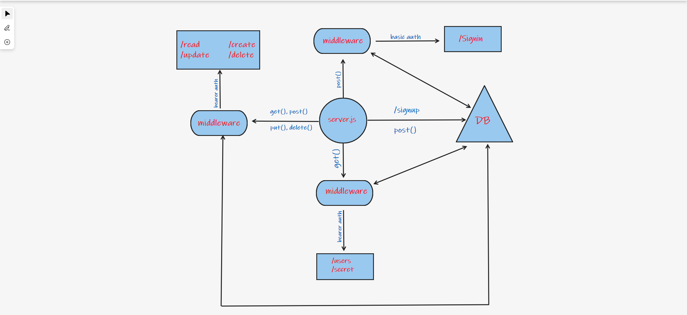

# Project: Car Store
## Lab 9
## Authors: 
- Rami Zregat
- Marwan Al Rawashdeh
- Essam Omar
- Suhaib Okour

**Description of the project:**  Back-end server for a car store that allow you to create account by signing up then you can sign in to your account, if you are a customer you can review our cars in the store, if you are a seller you can review the cars, add new one and edit any of these cars, if you are the Owner you can review,add,edit and delete any car you want, Also you can do the same thing with the accounts.

## Links to check:

- Heroku application for main branch: https://cars-store-project.herokuapp.com/

- Github pull request link: https://github.com/RamiZregat/Store/pull/3

## Dependencies:  

- morgan
- method-override
- jsonwebtoken
- eslint
- cors
- bcrypt
- base-64
- dotenv
- express
- jest
- supertest
- pg
- sequelize
- sequelize-cli
- sqlite3

## How to start the server:  
- pgstart
- npm start

## What should I run on the terminal or postman?  
- npm run test / on the terminal
- POST - http://localhost:3030/signup
- POST - http://localhost:3030/signin
- POST - http://localhost:3030/api/v1/cars
- GET - http://localhost:3030/api/v1/cars
- GET - http://localhost:3030/api/v1/cars/1
- PUT - http://localhost:3030/api/v1/cars/1
- DELETE - http://localhost:3030/api/v1/cars/1
- POST - http://localhost:3030/api/v1/accessories
- GET - http://localhost:3030/api/v1/accessories
- GET - http://localhost:3030/api/v1/accessories/1
- PUT - http://localhost:3030/api/v1/accessories/1
- DELETE - http://localhost:3030/api/v1/accessories/1
- POST - http://localhost:3030/api/v2/cars
- GET - http://localhost:3030/api/v2/cars
- GET - http://localhost:3030/api/v2/cars/1
- PUT - http://localhost:3030/api/v2/cars/1
- DELETE - http://localhost:3030/api/v2/cars/1
- POST - http://localhost:3030/api/v2/accessories
- GET - http://localhost:3030/api/v2/accessories
- GET - http://localhost:3030/api/v2/accessories/1
- PUT - http://localhost:3030/api/v2/accessories/1
- DELETE - http://localhost:3030/api/v2/accessories/1

## UML

